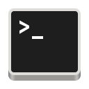

  <h1>Terminal</h1>
  <h4>A beautiful and simple GTK 4 terminal.</h4>
  

    <a href="#install">Install</a> •
    <a href="#features">Features</a> •
    <a href="./COPYING">License</a>
  

   
  <small><i>
    Terminal 42.alpha0 (theme <a href="https://github.com/storm119/Tilix-Themes/blob/master/Themes/japanesque.json" target="_blank">"Japanesque"</a>, fetch <a href="https://github.com/Rosettea/bunnyfetch">bunnyfetch</a>)
  </i></small>
    

> This is work in progress. Feel free to use Terminal and report any bugs you
> find.

I created this project so that I could use a decent looking terminal app on
Linux. There are more featureful alternatives out there.

## Features

- Theming ([Tilix](https://github.com/gnunn1/tilix) compatible color scheme support)
- Theme integration with the window decorations
- Custom fonts
- Tabs
- Headerbarless mode
- `Ctrl` + `click` to open links & files
- Drag files to paste their path

## Install

**Download**

- [Flatpak](https://gitlab.gnome.org/raggesilver/terminal/-/jobs/artifacts/master/raw/terminal.flatpak?job=build)
- [Zip](https://gitlab.gnome.org/raggesilver/terminal/-/jobs/artifacts/master/download?job=build)

*Note: these two links will not work if the latest pipeline failed/was skipped/is still running*

**Flathub**

Terminal will be available on Flathub when 42 is out.

## Compile

**Flatpak**

To build and run Terminal, use GNOME Builder, or VS Code along with [Vala](https://marketplace.visualstudio.com/items?itemName=prince781.vala) and [Flatpak](https://marketplace.visualstudio.com/items?itemName=bilelmoussaoui.flatpak-vscode) extensions.

If you want to manually build Terminal take a look at the build script in [.gitlab-ci.yml](./.gitlab-ci.yml).

## Some other screenshots

   
  <small><i>
    Terminal with "show headerbar" off.
  </i></small>
    

## Credits

- Most of Terminal's themes come (straight out copied) from [Tilix](https://github.com/gnunn1/tilix)
- Most non-Tilix-default themes come (straight out copied) from [Tilix-Themes](https://github.com/storm119/Tilix-Themes)
- Terminal's icon is a (very) slightly modified version of [GNOME Terminal's icon](https://gitlab.gnome.org/GNOME/gnome-terminal/-/blob/af6fa5af6ba69e3cd392de20e9c2954c6405a2dc/data/icons/hicolor_apps_scalable_org.gnome.Terminal.svg)
- Source code that derives from other projects is properly attributed in the code itself
